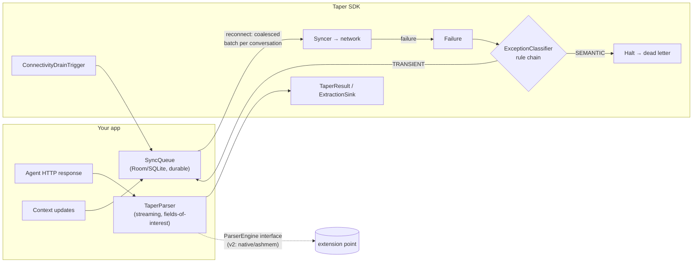

# Taper

[](https://github.com/rsngpt/taper/actions)
[](https://jitpack.io/#rsngpt/taper)
[](LICENSE)

**Website & docs: [rsngpt.github.io/taper](https://rsngpt.github.io/taper)** ·
[API reference](https://rsngpt.github.io/taper/api/)

On-device **memory and reliability SDK** for Android apps that embed AI agents
(LLM API calls, tool-use loops, long context histories).

Kotlin · minSdk 24 · three components, no cloud dependency:

1. **Streaming ingestion** — parse multi-megabyte agent-response JSON without
   building an in-memory DOM tree; extract only declared *fields of interest*.
2. **Exception classifier** — rules-based `SEMANTIC` vs `TRANSIENT` failure
   triage, so orchestration code stops retrying requests that can never succeed.
3. **Offline-safe sync queue** — a transactional, SQLite-backed queue that
   survives process death and **coalesces** per-conversation updates into one
   sync transaction on reconnect.

## Problem

Agent-integrated apps routinely receive large, context-rich JSON payloads
(message histories, tool-call transcripts). The standard Android habit —
`response.body!!.string()` into `org.json`/Gson tree mode — materialises the
whole document as a tree of maps, boxed numbers, and string headers, costing a
multiple of the raw payload size in heap. On budget devices (the 4–6GB RAM tier
that 2026 memory prices are pushing manufacturers back toward), the default
per-app heap limit makes this a crash, not a slowdown: the emulator profile used
in this repo's benchmark has a 192MB `dalvik.vm.heapgrowthlimit` and 2GB total
RAM.

Separately, naive retry loops treat every failure the same. Retrying a
malformed tool call or a content-policy rejection burns tokens, battery, and
money and can never succeed; *not* retrying a radio blip loses user data. And
when connectivity returns after an offline stretch, firing one request per
queued update floods the network with redundant calls.

## Architecture



- `TaperParser.parse(inputStream, fieldsOfInterest)` walks Moshi's streaming
  `JsonReader`. Unmatched subtrees are skipped token-by-token (cost: O(nesting
  depth)); matched scalars cost only themselves; a matched subtree materialises
  just that branch.
- `ExceptionClassifier` runs a chain of `ClassificationRule`s — error-body shape
  (provider envelopes), then HTTP status, then exception type — first non-null
  answer wins; unknown failures fall back to `TRANSIENT` (configurable).
- `SyncQueue.drain(syncer)` groups everything pending by conversation and hands
  the syncer **one oldest-first batch per conversation**. Rows are deleted only
  after the syncer succeeds (at-least-once). Failures are classified: semantic →
  dead letter, transient → stays pending up to an attempt cap.

## Setup

Requires JDK 17. Consume via JitPack:

```kotlin
// settings.gradle.kts
dependencyResolutionManagement {
    repositories { maven("https://jitpack.io") }
}
// build.gradle.kts
dependencies { implementation("com.github.rsngpt:taper:v0.1.0") }
```

Or build locally: `./gradlew :taper:publishToMavenLocal` → `dev.taper:taper:0.1.0`.

### Quick start

```kotlin
// 1. Parse a large agent response without a DOM
val result = TaperParser().parse(
    inputStream,
    fieldsOfInterest = setOf("model", "messages[].content", "usage.total_tokens"),
)
val tokens = result.firstLong("usage.total_tokens")

// 2. Classify failures before retrying
val classifier = ExceptionClassifier()
when (classifier.classify(AgentFailure(httpStatus = 429))) {
    FailureCategory.TRANSIENT -> queue.enqueue(conversationId, payload)
    FailureCategory.SEMANTIC -> surfaceToUser()
}

// 3. Durable offline queue, drained in coalesced batches on reconnect
val queue = SyncQueue.create(context)
queue.enqueue("conv-42", updateJson)
ConnectivityDrainTrigger(context, queue, syncer, scope).start()
```

## Benchmark (measured, not estimated)

Produced by `./run_benchmark.sh` (instrumented tests in `benchmark/`), run on
2026-07-14 against a **Pixel emulator, Android API 37, 2GB RAM,
`dalvik.vm.heapgrowthlimit=192m`, no `largeHeap`** — i.e. the default heap
budget a real app gets on a low-RAM device. Each (strategy × size) pair runs in
its own process (AndroidX Test Orchestrator), 3 iterations, synthetic
tool-call-heavy agent-response payloads generated on device; values are medians.
All strategies must extract the same facts (model, message count, total tokens),
so the comparison can't be gamed by doing less work.

| Payload | DOM org.json peak heap / time | DOM Gson tree peak heap / time | Taper streaming peak heap / time | OOM count (org.json / Gson / Taper) |
|---|---|---|---|---|
| 100KB | 0.8 MB / 4 ms | 0.5 MB / 14 ms | 0.2 MB / 21 ms | 0 / 0 / 0 |
| 500KB | 2.1 MB / 15 ms | 2.0 MB / 31 ms | 0.6 MB / 28 ms | 0 / 0 / 0 |
| 1MB | 4.3 MB / 32 ms | 4.2 MB / 39 ms | 0.7 MB / 39 ms | 0 / 0 / 0 |
| 2MB | 8.8 MB / 51 ms | 8.2 MB / 55 ms | 0.8 MB / 54 ms | 0 / 0 / 0 |
| 5MB | 21.7 MB / 102 ms | 20.7 MB / 103 ms | 1.5 MB / 88 ms | 0 / 0 / 0 |
| 10MB | 43.2 MB / 175 ms | 41.0 MB / 149 ms | 2.4 MB / 160 ms | 0 / 0 / 0 |
| 25MB *(stress, beyond spec)* | 108.0 MB / 408 ms | 100.6 MB / 296 ms | 5.6 MB / 328 ms | 0 / 0 / 0 |
| 50MB *(stress, beyond spec)* | **OutOfMemoryError** | **OutOfMemoryError** | 10.5 MB / 622 ms | 1 / 1 / 0 |

Reading the numbers measured above: on this payload shape DOM parsing cost
~4× the payload size in heap, growing linearly until it hit the 192MB app heap
limit between 25MB and 50MB and crashed; Taper's peak heap stayed roughly two
orders of magnitude lower (it scales with extracted fields + nesting depth, not
document size), with parse times in the same range as DOM. Peak heap = peak
Java heap during parse minus settled baseline, sampled every ~2ms; peak PSS was
also recorded (raw CSV: `benchmark/build/benchmark-results.csv`). Numbers are
specific to this payload shape and device profile — rerun `./run_benchmark.sh`
on your own target hardware before quoting them.

The unit-test suite proves the same cliff deterministically off-device:
`ConstrainedHeapTest` DOM-parses a 16MB payload in a child JVM capped at 32MB
(dies with `OutOfMemoryError`) and streams the identical file with Taper in the
same cap (succeeds).

## minSdk justification

**minSdk 24** (Android 7.0). Two reasons:

- `ConnectivityManager.registerDefaultNetworkCallback`, which
  `ConnectivityDrainTrigger` uses to drain the queue on reconnect, exists only
  on API 24+.
- The project targets budget hardware; API 24+ covers virtually every budget
  device still receiving app installs in 2026, while avoiding the
  `java.time`/desugaring complications of lower targets (Taper avoids
  `java.time` entirely).

## What's built vs. future work

**Built and tested in this repo (v1):**
- Streaming parser with field-of-interest extraction, path wildcards
  (`messages[].tool_calls[].name`, `metadata.*`, `[].id`), collecting and
  streaming-sink APIs.
- Rules-based exception classifier (body shape → status → exception type),
  extensible rule chain, configurable fallback.
- Room-backed durable sync queue with per-conversation coalescing,
  classifier-driven retry/dead-letter, connectivity trigger.
- 64 unit tests incl. a constrained-heap proof (DOM parse OOMs in a 32MB child
  JVM where Taper streams the same 16MB payload) and process-death recovery
  tests against the real on-disk database.
- Instrumented memory benchmark with per-test process isolation.

**Explicitly out of scope for v1 (extension points left, nothing else):**
- FlatBuffers / ashmem / JNI native memory mapping — the `ParserEngine`
  interface is the seam where a native engine would plug in without changing
  `TaperParser`'s public API.
- ML-based failure classification — `AgentFailure` is already a feature record;
  the scoped v2 path is logistic regression over (status bucket, exception
  class, body-shape tokens) trained offline on labelled retry outcomes, shipped
  as constant weights and inserted as one more `ClassificationRule` *after* the
  deterministic rules. Rules stay authoritative for documented contracts.
- Cloud gateway / compression proxy (e.g. LLMLingua-style context compression).
- WorkManager integration for scheduled background drains.

## Tradeoffs

**Streaming over DOM.** DOM parsing is O(document) in memory and fails at the
worst moment (largest payloads on smallest devices); streaming is O(depth +
extracted fields). The price: no random access — callers must declare fields up
front, and re-reading requires re-parsing. For agent responses this fits the
access pattern (you know which fields you need; payloads are read once).
Alternatives considered: **Moshi/kotlinx codegen adapters** — typed and fast,
but still materialise everything the type declares, require a schema per
provider, and can't skip unknown-but-huge subtrees the type doesn't mention;
**JsonPath libraries** — most implementations DOM-parse internally;
**android.util.JsonReader** — equivalent streaming semantics but untestable on
the JVM (Moshi's `JsonReader` runs in plain unit tests).

**Rules over ML for classification.** Retryability signals are documented
contracts (RFC 9110 status semantics, provider error envelopes, exception
types), near-deterministic and enumerable — a rule table is auditable,
adds zero inference cost, and its failure mode is a visible gap in a table
rather than a silent statistical misfire that drops user data. ML earns its
complexity only where signals are ambiguous; that tie-breaking role is exactly
the scoped v2 slot described above.

**Room over raw SQLite / files / WorkManager.** Raw SQLite saves a dependency
but re-implements transactions, threading, and migrations Taper gets for free;
flat files can't do atomic partial-batch deletion; WorkManager schedules work
but is not a queue — it complements, not replaces, durable rows (and would
have forced minSdk/dependency weight on consumers who don't want scheduling).

**Coalescing per conversation, not globally.** A global batch would be one
request, but couples unrelated conversations' failure domains: one poisoned
conversation would block everything. Per-conversation batches keep failure
isolation (verified by the partial-failure test) while still collapsing N
updates into 1 request per conversation.

**Fallback = TRANSIENT.** Misclassifying transient→semantic silently drops a
user's update (unbounded harm); misclassifying unknown→transient wastes at most
`maxAttempts` retries (bounded, and dead-letters at the cap). Teams with tight
retry budgets can flip the default in one constructor argument.

## Repo layout / running things

```
taper/       the SDK library (parser, classifier, queue) + all unit tests
benchmark/   app module hosting the instrumented memory benchmark
./gradlew testDebugUnitTest      # all unit tests (JVM, no device needed)
./run_benchmark.sh               # instrumented benchmark on connected device → table
```

CI (GitHub Actions) runs unit tests + lint on every push. The instrumented
benchmark is deliberately not in CI: its numbers only mean something on a
device profile you control.
