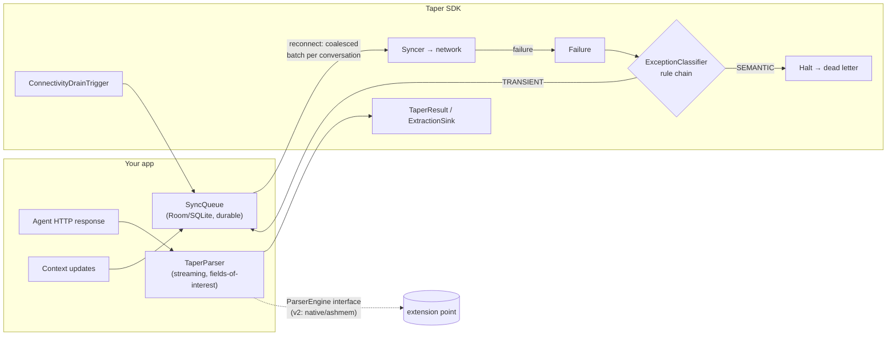

# Taper

[](https://github.com/rsngpt/taper/actions)
[](https://jitpack.io/#rsngpt/taper)
[](LICENSE)

**Website & docs: [rsngpt.github.io/taper](https://rsngpt.github.io/taper)** ·
[API reference](https://rsngpt.github.io/taper/api/)

On-device **memory and reliability SDK** for Android apps that embed AI agents
(LLM API calls, tool-use loops, long context histories).

Kotlin · minSdk 24 · three components, no cloud dependency:

1. **Streaming ingestion** — parse multi-megabyte agent-response JSON without
   building an in-memory DOM tree; extract only declared *fields of interest*.
2. **Exception classifier** — rules-based `SEMANTIC` vs `TRANSIENT` failure
   triage, so orchestration code stops retrying requests that can never succeed.
3. **Offline-safe sync queue** — a transactional, SQLite-backed queue that
   survives process death and **coalesces** per-conversation updates into one
   sync transaction on reconnect.

## Problem

Agent-integrated apps routinely receive large, context-rich JSON payloads
(message histories, tool-call transcripts). The standard Android habit —
`response.body!!.string()` into `org.json`/Gson tree mode — materialises the
whole document as a tree of maps, boxed numbers, and string headers, costing a
multiple of the raw payload size in heap. On budget devices (the 4–6GB RAM tier
that 2026 memory prices are pushing manufacturers back toward), the default
per-app heap limit makes this a crash, not a slowdown: the emulator profile used
in this repo's benchmark has a 192MB `dalvik.vm.heapgrowthlimit` and 2GB total
RAM.

Separately, naive retry loops treat every failure the same. Retrying a
malformed tool call or a content-policy rejection burns tokens, battery, and
money and can never succeed; *not* retrying a radio blip loses user data. And
when connectivity returns after an offline stretch, firing one request per
queued update floods the network with redundant calls.

## Architecture



- `TaperParser.parse(inputStream, fieldsOfInterest)` walks Moshi's streaming
  `JsonReader`. Unmatched subtrees are skipped token-by-token (cost: O(nesting
  depth)); matched scalars cost only themselves; a matched subtree materialises
  just that branch.
- `ExceptionClassifier` runs a chain of `ClassificationRule`s — error-body shape
  (provider envelopes), then HTTP status, then exception type — first non-null
  answer wins; unknown failures fall back to `TRANSIENT` (configurable).
- `SyncQueue.drain(syncer)` groups everything pending by conversation and hands
  the syncer **one oldest-first batch per conversation**. Rows are deleted only
  after the syncer succeeds (at-least-once). Failures are classified: semantic →
  dead letter, transient → stays pending up to an attempt cap.

## Setup

Requires JDK 17. Consume via JitPack:

```kotlin
// settings.gradle.kts
dependencyResolutionManagement {
    repositories { maven("https://jitpack.io") }
}
// build.gradle.kts
dependencies { implementation("com.github.rsngpt:taper:v0.1.1") }
```

Or build locally: `./gradlew :taper:publishToMavenLocal` → `dev.taper:taper:0.1.1`.

### Quick start

```kotlin
// 1. Parse a large agent response without a DOM
val result = TaperParser().parse(
    inputStream,
    fieldsOfInterest = setOf("model", "messages[].content", "usage.total_tokens"),
)
val tokens = result.firstLong("usage.total_tokens")

// 2. Classify failures before retrying
val classifier = ExceptionClassifier()
when (classifier.classify(AgentFailure(httpStatus = 429))) {
    FailureCategory.TRANSIENT -> queue.enqueue(conversationId, payload)
    FailureCategory.SEMANTIC -> surfaceToUser()
}

// 3. Durable offline queue, drained in coalesced batches on reconnect
val queue = SyncQueue.create(context)
queue.enqueue("conv-42", updateJson)
ConnectivityDrainTrigger(context, queue, syncer, scope).start()
```

## Benchmark (measured, not estimated)

### Emulator: low-RAM profile (2GB)

Produced by `./run_benchmark.sh` (instrumented tests in `benchmark/`), run on
2026-07-14 against a **Pixel emulator, Android API 37, 2GB RAM,
`dalvik.vm.heapgrowthlimit=192m`, no `largeHeap`** — i.e. the default heap
budget a real app gets on a low-RAM device. Each (strategy × size) pair runs in
its own process (AndroidX Test Orchestrator), 3 iterations, synthetic
tool-call-heavy agent-response payloads generated on device; values are medians.
All strategies must extract the same facts (model, message count, total tokens),
so the comparison can't be gamed by doing less work.

| Payload | DOM org.json peak heap / time | DOM Gson tree peak heap / time | Taper streaming peak heap / time | OOM count (org.json / Gson / Taper) |
|---|---|---|---|---|
| 100KB | 0.8 MB / 4 ms | 0.5 MB / 14 ms | 0.2 MB / 21 ms | 0 / 0 / 0 |
| 500KB | 2.1 MB / 15 ms | 2.0 MB / 31 ms | 0.6 MB / 28 ms | 0 / 0 / 0 |
| 1MB | 4.3 MB / 32 ms | 4.2 MB / 39 ms | 0.7 MB / 39 ms | 0 / 0 / 0 |
| 2MB | 8.8 MB / 51 ms | 8.2 MB / 55 ms | 0.8 MB / 54 ms | 0 / 0 / 0 |
| 5MB | 21.7 MB / 102 ms | 20.7 MB / 103 ms | 1.5 MB / 88 ms | 0 / 0 / 0 |
| 10MB | 43.2 MB / 175 ms | 41.0 MB / 149 ms | 2.4 MB / 160 ms | 0 / 0 / 0 |
| 25MB *(stress, beyond spec)* | 108.0 MB / 408 ms | 100.6 MB / 296 ms | 5.6 MB / 328 ms | 0 / 0 / 0 |
| 50MB *(stress, beyond spec)* | **OutOfMemoryError** | **OutOfMemoryError** | 10.5 MB / 622 ms | 1 / 1 / 0 |

Reading the numbers measured above: on this payload shape DOM parsing cost
~4× the payload size in heap, growing linearly until it hit the 192MB app heap
limit between 25MB and 50MB and crashed; Taper's peak heap stayed roughly two
orders of magnitude lower (it scales with extracted fields + nesting depth, not
document size), with parse times in the same range as DOM. Peak heap = peak
Java heap during parse minus settled baseline, sampled every ~2ms; peak PSS was
also recorded (raw CSVs committed under `benchmark/results/`). Numbers are
specific to this payload shape and device profile — rerun `./run_benchmark.sh`
on your own target hardware before quoting them.

### Real hardware: Redmi Note 7 Pro (4GB RAM)

Same harness, run 2026-07-14 on a **Redmi Note 7 Pro — Android 10 (API 29),
4GB RAM, `dalvik.vm.heapgrowthlimit=256m`, MIUI, no `largeHeap`**. One
difference in mechanics, same isolation guarantee: MIUI blocks the Test
Orchestrator's permission-granting install, so each (strategy × size) pair was
run as its own `am instrument` invocation from the host — still one fresh
process per measurement, 3 iterations, medians.

| Payload | DOM org.json peak heap / time | DOM Gson tree peak heap / time | Taper streaming peak heap / time | OOM count (org.json / Gson / Taper) |
|---|---|---|---|---|
| 100KB | 1.4 MB / 33 ms | 0.5 MB / 45 ms | 0.2 MB / 14 ms | 0 / 0 / 0 |
| 500KB | 4.5 MB / 69 ms | 2.6 MB / 87 ms | 1.1 MB / 51 ms | 0 / 0 / 0 |
| 1MB | 7.5 MB / 161 ms | 5.0 MB / 175 ms | 1.8 MB / 124 ms | 0 / 0 / 0 |
| 2MB | 18.1 MB / 304 ms | 9.9 MB / 329 ms | 2.3 MB / 225 ms | 0 / 0 / 0 |
| 5MB | 58.8 MB / 830 ms | 24.1 MB / 1018 ms | 3.6 MB / 464 ms | 0 / 0 / 0 |
| 10MB | 103.5 MB / 1300 ms | 47.0 MB / 1052 ms | 6.5 MB / 845 ms | 0 / 0 / 0 |
| 25MB *(stress, beyond spec)* | 175.9 MB / 3156 ms | 110.0 MB / 2617 ms | 11.9 MB / 1854 ms | 0 / 0 / 0 |
| 50MB *(stress, beyond spec)* | **OutOfMemoryError** | 213.0 MB / 5249 ms | 21.2 MB / 3908 ms | 1 / 0 / 0 |

A repeat run on the same device reproduced the heap medians within a few
percent at payloads ≥5MB (org.json 103.5→102.2MB at 10MB; Gson 213→208MB at
50MB) and reproduced the org.json OOM at 50MB; sub-2MB medians vary more with
GC timing, and wall-times inflated up to ~2.5× as the SoC thermally throttled
on the back-to-back run (both raw CSVs are in `benchmark/results/`).

The real device is harsher on the naive path than the emulator: org.json (whole
body as a `String`, then a tree) cost roughly **10× the payload size** here —
103.5MB of heap for a 10MB response — and hit `OutOfMemoryError` at 50MB even
with this device's larger 256MB heap limit. Gson tree survived 50MB only by
consuming 213MB, a few percent below the limit, i.e. one background allocation
away from death. Taper peaked at 21.2MB on the same payload. Parse times on
this 2019-class SoC are 5–8× the emulator's, which also means DOM's multi-second
GC-pressure stalls land on the UI thread's watch.

### Real hardware: Samsung Galaxy A31 (6GB RAM)

Same harness, run 2026-07-14 on a **Samsung Galaxy A31 (SM-A315F) — Android 12
(API 31), 6GB RAM, `dalvik.vm.heapgrowthlimit=256m`, One UI, no `largeHeap`**.
Unlike the Redmi, this device accepted the Test Orchestrator's install
normally, so this run used the unmodified `./run_benchmark.sh` path — 24/24
tests passed with zero failures.

| Payload | DOM org.json peak heap / time | DOM Gson tree peak heap / time | Taper streaming peak heap / time | OOM count (org.json / Gson / Taper) |
|---|---|---|---|---|
| 100KB | 0.7 MB / 12 ms | 0.5 MB / 52 ms | 0.2 MB / 79 ms | 0 / 0 / 0 |
| 500KB | 3.3 MB / 56 ms | 2.5 MB / 120 ms | 0.9 MB / 97 ms | 0 / 0 / 0 |
| 1MB | 6.6 MB / 121 ms | 5.1 MB / 172 ms | 1.9 MB / 142 ms | 0 / 0 / 0 |
| 2MB | 9.1 MB / 287 ms | 8.9 MB / 316 ms | 3.8 MB / 235 ms | 0 / 0 / 0 |
| 5MB | 22.4 MB / 694 ms | 24.2 MB / 566 ms | 6.6 MB / 567 ms | 0 / 0 / 0 |
| 10MB | 44.8 MB / 1316 ms | 46.7 MB / 1152 ms | 7.9 MB / 1073 ms | 0 / 0 / 0 |
| 25MB *(stress, beyond spec)* | 109.3 MB / 3256 ms | 114.3 MB / 2486 ms | 11.6 MB / 2649 ms | 0 / 0 / 0 |
| 50MB *(stress, beyond spec)* | 219.8 MB / 6348 ms | 229.3 MB / 5131 ms | 20.5 MB / 5108 ms | 0 / 0 / 0 |

Same 256MB per-app heap limit as the Redmi, but **no OOM anywhere** — org.json
squeaked through 50MB at 219.8MB, ~36MB below the cap. The two Android 4GB vs
6GB devices share an identical `dalvik.vm.heapgrowthlimit`, so the difference
isn't the per-app cap; it's everything else competing for that budget under
One UI vs MIUI at the moment of the run. This is exactly why the README
caveats each table as "measured on this device, at this moment" rather than a
universal number: the *shape* of the result (Taper's heap flat, DOM's linear)
reproduces across every device tested; the exact MB where DOM tips into OOM
does not.

### Deterministic off-device proof

The unit-test suite proves the same cliff without any device:
`ConstrainedHeapTest` DOM-parses a 16MB payload in a child JVM capped at 32MB
(dies with `OutOfMemoryError`) and streams the identical file with Taper in the
same cap (succeeds).

## Validated against live traffic

Synthetic benchmarks prove memory behaviour; they don't prove the components
survive a real agent loop. The [`demo/`](demo/) module is a minimal chat app
(bare `HttpURLConnection` — Taper is HTTP-client-agnostic) that runs all three
components against a **live local LLM server** (Ollama + `qwen2.5:3b`, tool
calling enabled), driven through scripted failure drills on 2026-07-15:

| Drill | What happened |
|---|---|
| Happy path + tool call | Model requested `get_device_time`; `TaperParser` extracted `message.tool_calls[].function.{name,arguments}` and token counts straight off the live response stream; tool round-trip completed. |
| Server killed mid-request | Genuine `ConnectException` → classifier: **TRANSIENT** → message queued. |
| Process death with a queued message | App process killed (twice) while the message sat in the queue; on next launch `ConnectivityDrainTrigger` fired **automatically** and replayed it (`synced=1`), no user action. |
| Airplane mode, 3 messages sent offline | Each classified TRANSIENT and queued; on reconnect the trigger drained **one coalesced batch** (`synced=3 transient=0 semantic=0`). |
| Deliberately malformed request | Genuine Ollama `HTTP 400` (`json: cannot unmarshal…`) → classifier: **SEMANTIC** → halted, zero retries, nothing queued. |

**What live traffic caught that synthetic tests didn't** — three real bugs, all
in the demo's own integration code, with the library behaving as designed
around each:

1. Moshi's `JsonWriter.jsonValue(String)` encodes a *quoted string*, not raw
   JSON — the first real request produced a genuine 400, which the classifier
   correctly ruled SEMANTIC and refused to retry. (Fix: `valueSink()`.)
2. Handing `ConnectivityDrainTrigger` a main-thread scope makes every syncer
   die instantly with `NetworkOnMainThreadException` — an exception no rule
   knows, so the classifier's TRANSIENT fallback kept the data queued instead
   of dropping it (the designed bounded failure mode). The trigger's KDoc now
   documents the I/O-dispatcher requirement.
3. `ScrollView.fullScroll(FOCUS_DOWN)` steals focus from the input field
   (UI-only, but a reminder that "works once" ≠ "works twice").

Evidence is committed under [`demo/validation/`](demo/validation/): the
on-device transcript showing every drill's classifier verdict and queue state
([full transcript](demo/validation/live-drills-full-transcript.png)), the
screenshot of the very first live request surfacing the `jsonValue` bug as a
real 400 ([screenshot](demo/validation/first-real-request-caught-jsonvalue-bug.png)),
and the server's access log for the session.

Run it yourself: `ollama serve` + `ollama pull qwen2.5:3b` on the host, then
`./gradlew :demo:installDebug` on an emulator (it reaches the host at
`10.0.2.2:11434`).

## minSdk justification

**minSdk 24** (Android 7.0). Two reasons:

- `ConnectivityManager.registerDefaultNetworkCallback`, which
  `ConnectivityDrainTrigger` uses to drain the queue on reconnect, exists only
  on API 24+.
- The project targets budget hardware; API 24+ covers virtually every budget
  device still receiving app installs in 2026, while avoiding the
  `java.time`/desugaring complications of lower targets (Taper avoids
  `java.time` entirely).

## What's built vs. future work

**Built and tested in this repo (v1):**
- Streaming parser with field-of-interest extraction, path wildcards
  (`messages[].tool_calls[].name`, `metadata.*`, `[].id`), collecting and
  streaming-sink APIs.
- Rules-based exception classifier (body shape → status → exception type),
  extensible rule chain, configurable fallback.
- Room-backed durable sync queue with per-conversation coalescing,
  classifier-driven retry/dead-letter, connectivity trigger.
- 64 unit tests incl. a constrained-heap proof (DOM parse OOMs in a 32MB child
  JVM where Taper streams the same 16MB payload) and process-death recovery
  tests against the real on-disk database.
- Instrumented memory benchmark with per-test process isolation.
- Live-traffic validation: a `demo/` chat app exercising all three components
  against a real local LLM server (tool calls, induced failures, offline
  drills — see § Validated against live traffic).

**Explicitly out of scope for v1 (extension points left, nothing else):**
- FlatBuffers / ashmem / JNI native memory mapping — the `ParserEngine`
  interface is the seam where a native engine would plug in without changing
  `TaperParser`'s public API.
- ML-based failure classification — `AgentFailure` is already a feature record;
  the scoped v2 path is logistic regression over (status bucket, exception
  class, body-shape tokens) trained offline on labelled retry outcomes, shipped
  as constant weights and inserted as one more `ClassificationRule` *after* the
  deterministic rules. Rules stay authoritative for documented contracts.
- Cloud gateway / compression proxy (e.g. LLMLingua-style context compression).
- WorkManager integration for scheduled background drains.

## Tradeoffs

**Streaming over DOM.** DOM parsing is O(document) in memory and fails at the
worst moment (largest payloads on smallest devices); streaming is O(depth +
extracted fields). The price: no random access — callers must declare fields up
front, and re-reading requires re-parsing. For agent responses this fits the
access pattern (you know which fields you need; payloads are read once).
Alternatives considered: **Moshi/kotlinx codegen adapters** — typed and fast,
but still materialise everything the type declares, require a schema per
provider, and can't skip unknown-but-huge subtrees the type doesn't mention;
**JsonPath libraries** — most implementations DOM-parse internally;
**android.util.JsonReader** — equivalent streaming semantics but untestable on
the JVM (Moshi's `JsonReader` runs in plain unit tests).

**Rules over ML for classification.** Retryability signals are documented
contracts (RFC 9110 status semantics, provider error envelopes, exception
types), near-deterministic and enumerable — a rule table is auditable,
adds zero inference cost, and its failure mode is a visible gap in a table
rather than a silent statistical misfire that drops user data. ML earns its
complexity only where signals are ambiguous; that tie-breaking role is exactly
the scoped v2 slot described above.

**Room over raw SQLite / files / WorkManager.** Raw SQLite saves a dependency
but re-implements transactions, threading, and migrations Taper gets for free;
flat files can't do atomic partial-batch deletion; WorkManager schedules work
but is not a queue — it complements, not replaces, durable rows (and would
have forced minSdk/dependency weight on consumers who don't want scheduling).

**Coalescing per conversation, not globally.** A global batch would be one
request, but couples unrelated conversations' failure domains: one poisoned
conversation would block everything. Per-conversation batches keep failure
isolation (verified by the partial-failure test) while still collapsing N
updates into 1 request per conversation.

**Fallback = TRANSIENT.** Misclassifying transient→semantic silently drops a
user's update (unbounded harm); misclassifying unknown→transient wastes at most
`maxAttempts` retries (bounded, and dead-letters at the cap). Teams with tight
retry budgets can flip the default in one constructor argument.

## Repo layout / running things

```
taper/       the SDK library (parser, classifier, queue) + all unit tests
benchmark/   app module hosting the instrumented memory benchmark
./gradlew testDebugUnitTest      # all unit tests (JVM, no device needed)
./run_benchmark.sh               # instrumented benchmark on connected device → table
```

CI (GitHub Actions) runs unit tests + lint on every push. The instrumented
benchmark is deliberately not in CI: its numbers only mean something on a
device profile you control.
